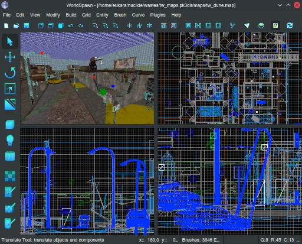

#  WorldSpawn
The worlds most opinionated fork of QER.

The editor we use at Vera Visions to create BSP levels.
It was forked from NetRadiant in 2018 and was a result of necessity.

We wanted to move away from a proprietary toolchain that had technical issues the developer would not ever get back to us about, so we ended up here.

Use it if you actually want to use the features listed below - note that they require a modified engine as our BSP format is different from standard idTech 3 BSP.
You will not be able to make levels compatible with other games and engines.

There's plenty of other editors for the first-party id Tech games.

## Editor Changes
- Valve 220 format is used top to bottom, imported & exported, with texture coords handled internally the same way
- Integration with our material system (no more .shader files)
- Support for vertex-color/alpha editing of patches using our new fixed patch format, allowing technologies such as 4-way texture blending and whatever your designers can imagine
- Gracefully deals with duplicate entity attribute key/value pairs, to support features like Source Engine style Input/Output system for triggers
- Simplified build system that doesn't suddenly break on its own, also less dependencies
- Support for VVM/IQM model format in the BSP compiler
- Support for internal and external High-Dynamic-Range lightmaps in the BSP compiler
- Support for cubemap aware surfaces in the BSP compiler
- Support for our patchDef2WS and patchDef3WS curved surfaces in the BSP compiler
- More bug-fixes than you could possibly imagine

## Compiling
To compile on a standard GNU/Linux system:
`LDFLAGS=-ldl gmake -j $(nproc)`

For BSD systems you'll have to point CFLAGS to whereever your package headers are installed.
gtkgtlext-1.0 is notorious for using both include and lib/gtkgtlext-1.0/include for headers. Yes.

Clang should also be supported, pass CC=clang and CXX=clang++ if you want to use it.

On NT you'll probably have a build command-line likes this:
`CC=i686-w64-mingw32-gcc CXX=i686-w64-mingw32-g++ PKG_CONFIG_PATH=/usr/x86_64-w64-mingw32/sys-root/mingw/lib/pkgconfig make -j 4`
Not all works yet, but stay tuned.

## Dependencies
* gcc-c++
* gtk2-devel
* gtkglext-devel
* libxml2-devel
* libjpeg8-devel
* minizip-devel

## Support
If you need help with this, you're better off using an alternative editor.
Compatibility is not a priority here.
